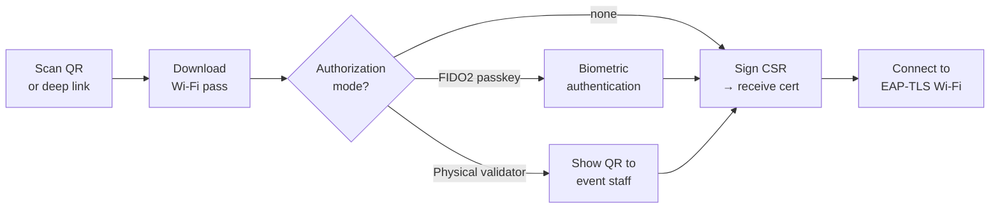

# MyWifiPass Android


Mobile client for the [MyWifiPass System](https://github.com/Pablodiz/mywifipass_system). Scans a Wi-Fi pass QR code, generates an RSA-2048 key pair on-device, signs a CSR, and installs the resulting certificate for EAP-TLS Wi-Fi connectivity.

---

## How It Works



The private key is generated on-device and **never transmitted** to the server. The server signs only the CSR.

---

## Features

**End users**

- Scan a Wi-Fi pass QR code or open a `mywifipass://` link to add a network in one tap
- FIDO2 / Passkey self-authorization via Android Credential Manager (fingerprint, face, PIN) — no admin needed
- Real-time authorization status via Server-Sent Events (< 2s), with fallback to one-shot HTTP
- Automatic EAP-TLS certificate installation and Wi-Fi configuration via `WifiEnterpriseConfig`
- Long-press to remove a pass and revoke locally stored certificates

**Validators** (event staff who verify user identities on-site)

- Scan a user's Wi-Fi pass QR to retrieve their name and ID document for verification
- Grant a 3-minute certificate signing window once identity is confirmed
- Login via password or a short-lived QR token generated from the server admin panel

---

## Quick Start

Download the latest APK from the [releases page](https://github.com/Pablodiz/mywifipass_android/releases), install it, and scan a Wi-Fi pass QR code from your event email.

---

## Build from Source

**Requirements:** Android Studio Ladybug 2024.2.1+, JDK 17, Android SDK 35 (min SDK 29)

```bash
git clone https://github.com/Pablodiz/mywifipass_android.git
cd mywifipass_android/mywifipass
./gradlew assembleDebug
```

Output: `app/build/outputs/apk/debug/app-debug.apk`

For a release build, place `mi-release-key.jks` in `mywifipass/app/` and create `mywifipass/.env`:

```properties
STORE_PASSWORD=your_keystore_password
```

---

## Documentation

| Document | Content |
|---|---|
| [Architecture](docs/architecture.md) | Component overview, FIDO2 flow, data flow diagrams |
| [User Guide](docs/usage.md) | Adding passes, FIDO2 validation, Wi-Fi connection, admin panel |
| [FIDO2 Guide](docs/fido2-guide.md) | Passkey authentication flow, modes, error handling |
| [Security Model](docs/security.md) | Encrypted token storage, CSR key handling, URL validation |
| [Installation](docs/installation.md) | Build requirements and steps |
| [Configuration](docs/configuration.md) | Server URL, signing setup, network security config |
| [Development Guide](docs/development.md) | Local build, debugging, Room migrations, code style |
| [Project Structure](docs/project-structure.md) | Directory tree with explanations |
| [Troubleshooting](docs/troubleshooting.md) | Common issues: FIDO2, certificates, Wi-Fi, build |
| [Changelog](docs/changelog.md) | Version history |

---

## Stack

| Layer | Technology |
|---|---|
| Language | Kotlin |
| UI | Jetpack Compose (Material 3) |
| HTTP | `HttpURLConnection` via `httpPetition()` wrapper |
| SSE | `HttpURLConnection` + `BufferedReader` loop |
| Cryptography | JCE `KeyPairGenerator` (RSA-2048) + Bouncy Castle (CSR signing) |
| FIDO2 | `androidx.credentials` (Credential Manager) |
| Storage | Room (SQLite) + EncryptedSharedPreferences (AES-256-GCM) |

---

## Related

- **[MyWifiPass System](https://github.com/Pablodiz/mywifipass_system)** — server-side platform (Django + FreeRADIUS)
- **[TFG Repository](https://github.com/Pablodiz/TFG_proyecto)** — degree thesis project

---

*Copyright (c) 2025, Pablo Diz de la Cruz — [BSD 3-Clause License](LICENSE)*
