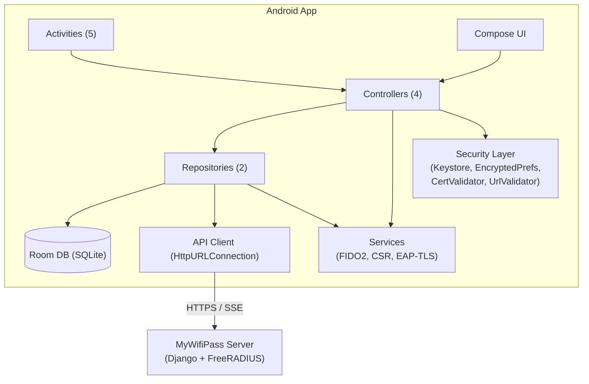
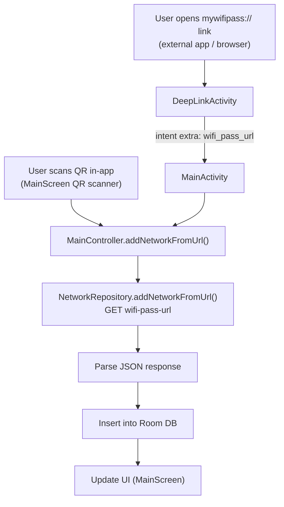
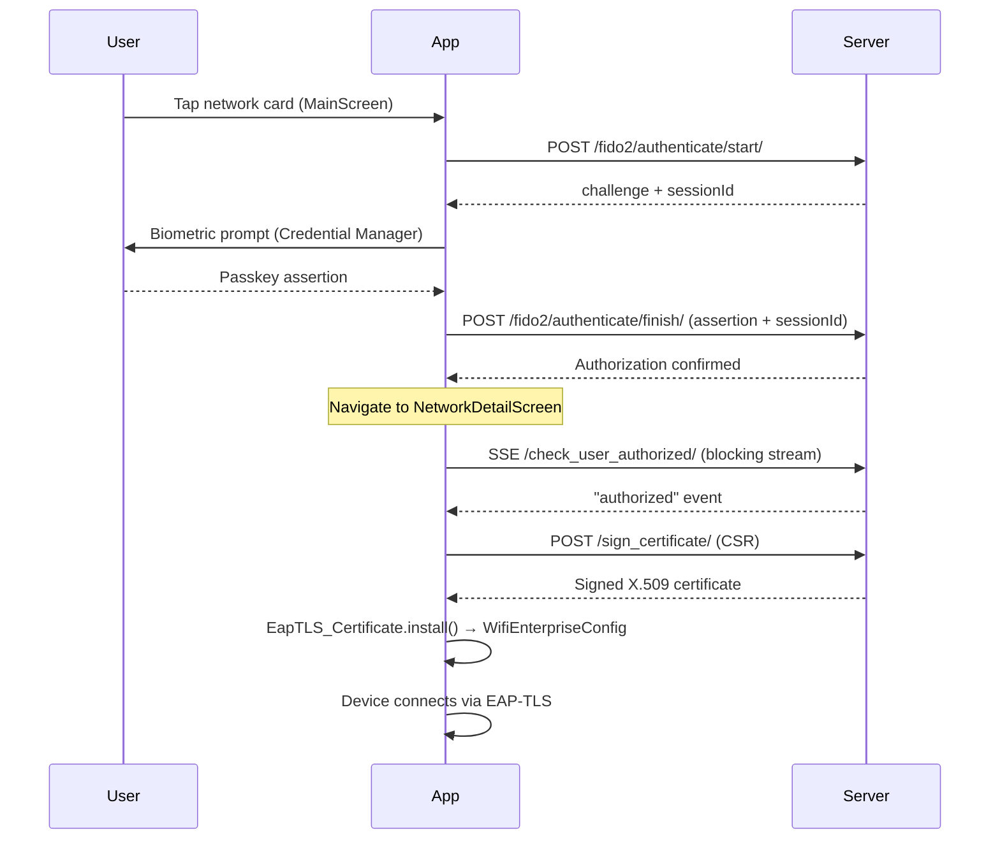

# Architecture

## High-Level Architecture

## Component Overview

### Activities (5)

| Activity | Purpose |
|---|---|
| `MainActivity` | Entry point - network list, QR scanner trigger |
| `LoginActivity` | Validator login via credentials or QR token from server |
| `AdminActivity` | Validator panel - scan user QR, verify identity, authorize |
| `NetworkDetailActivity` | Per-network detail: SSE authorization stream, certificate installation, Wi-Fi connection status |
| `DeepLinkActivity` | Handles `mywifipass://` URI scheme for Wi-Fi pass URLs |

### Controllers (4)

Controllers bridge UI events and business logic. They coordinate repositories, services, and state updates.

| Controller | Scope |
|---|---|
| `MainController` | Network CRUD, FIDO2 validation, CSR signing, SSE auth |
| `LoginController` | Validator login - credentials or QR token parsing |
| `AdminController` | Admin QR validation and attendee authorization |
| `RoleController` | Role/auth state - token presence, redirect decisions |

### Repositories (2)

| Repository | Responsibility |
|---|---|
| `AuthRepository` | Token persistence via EncryptedSharedPreferences, login state |
| `NetworkRepository` | Network CRUD against Room DB + remote API, SSE streaming |

### Services

| Service | Purpose |
|---|---|
| `Fido2Service` | FIDO2/WebAuthn flow: get challenge → Credential Manager → verify |
| `CredentialHelper` | Wraps `androidx.credentials` API (requires Activity context) |
| `CSR` | RSA-2048 key pair generation (JCE) + CSR signing + PEM encoding via Bouncy Castle |
| `EapTLS_Certificate` | Certificate parsing and installation into `WifiEnterpriseConfig` |
| `EapTLSConnection` | Wi-Fi connection via `WifiEnterpriseConfig` (EAP-TLS) |

### Data Layer

| Component | Technology |
|---|---|
| Local DB | Room (SQLite) - networks, connection state |
| API Client | `HttpURLConnection` via `httpPetition()` wrapper (single-shot, no retry) |
| SSE Client | `HttpURLConnection` + `BufferedReader` loop returning `SseOutcome` enum |
| Serialization | Gson + kotlinx.serialization for JSON parsing |

### Security Layer

| Component | Purpose |
|---|---|
| `EncryptedSharedPreferences` | AES-256-GCM encrypted token storage |
| `CertificateValidator` | Expiry, chain, and format validation for X.509 certs |
| `UrlValidator` | URL validation - both HTTP and HTTPS accepted; rejects `%`-encoding, non-ASCII, `..` |
| `Android Keystore` | Token master key for EncryptedSharedPreferences (AES-256-GCM) |

---

## Data Flow: Adding a Wi-Fi Pass

Two entry points, same outcome:

## Data Flow: FIDO2 Validation + Certificate Installation

## Activity Lifecycle

All sensitive activities (`LoginActivity`, `AdminActivity`, `NetworkDetailActivity`) use `FLAG_SECURE` to prevent screenshots and screen recording. The app uses Jetpack Compose with `LaunchedEffect` for side effects such as SSE connections and authorization checks.
