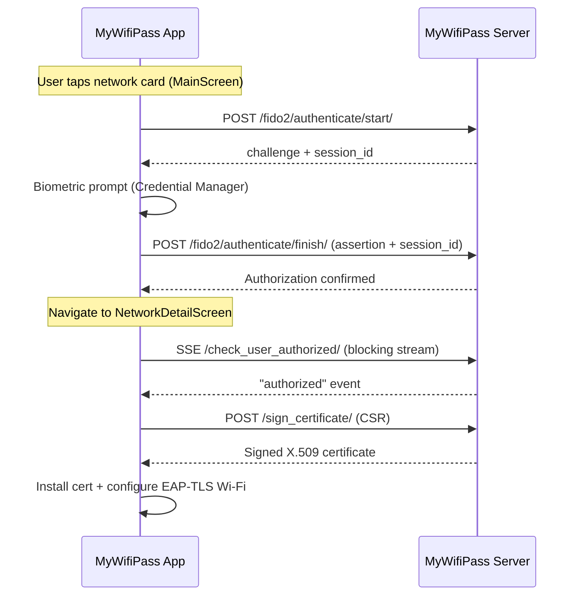

# FIDO2 / Passkey Guide (Android)

## Overview

The MyWifiPass Android app supports **FIDO2/WebAuthn** (Passkeys) for passwordless biometric validation. This allows end users to self-authorize their Wi-Fi access without an admin manually scanning a QR code.

## Architecture



## Authentication Modes

### Discoverable Mode (Default)

- The app sends an empty request body `{}` to `/authenticate/start/`
- Server responds with `allowCredentials: []` and a `session_id` UUID
- Android Credential Manager shows a **passkey picker** - user selects which account to use
- Server identifies the user from the **credential ID** embedded in the WebAuthn assertion
- No email is needed - the user's identity is derived from the passkey itself

### Email Mode

- The app sends `{"email": "user@example.com"}` to `/authenticate/start/`
- Server pre-selects the user's registered credential
- Bypasses the passkey picker; the credential is resolved directly from the email
- Currently unused - the app always uses discoverable mode

## Implementation Details

### Key Classes

| Class | Role |
|---|---|
| `Fido2Service` | Orchestrates the 3-step WebAuthn flow |
| `CredentialHelper` | Wraps `androidx.credentials.CredentialManager` |
| `ApiPetitions.fido2AuthenticateStart()` | Sends challenge request; returns `Pair<optionsJson, sessionId>` |
| `ApiPetitions.fido2AuthenticateFinish()` | Sends assertion; accepts optional `sessionId` |

### Credential Manager Integration

The app uses `GetPublicKeyCredentialOption` with `GetCredentialRequest`:

```kotlin
val getRequest = GetPublicKeyCredentialOption(optionsJson, null)
val credentialRequest = GetCredentialRequest(listOf(getRequest))
val result = getCredential(activity, credentialRequest)
val credential = result.credential as PublicKeyCredential
```

The `optionsJson` passed to Credential Manager is already stripped of non-standard fields (like `session_id`) - this stripping happens inside `fido2AuthenticateStart` in `ApiPetitions.kt` before the options are returned to `Fido2Service`. Some provider implementations reject unknown fields in the WebAuthn JSON.

### Session ID Flow

1. `/authenticate/start/` returns `session_id` (UUID) in discoverable mode
2. App stores it and echoes it back in `/authenticate/finish/` as `{"session_id": "...", "credential": ...}`
3. Server uses `session_id` to retrieve the challenge (no email needed)

## Passkey Registration

Passkey registration is handled via the server's web UI at `/fido2/register/`. The Android app does not implement in-app registration - users must register their passkey through the web portal first.

## Error Handling

| Error | Cause | Solution |
|---|---|---|
| `GetCredentialException` | No passkey found, user cancelled, or Credential Manager unavailable | Check device has screen lock + Google Play Services |
| `NoCredentialException` | No passkey registered for this domain | Register a passkey via `/fido2/register/` first |
| `"Authentication failed"` | Assertion verification failed on server | Challenge may have expired; retry |
| `"Session not found or expired"` | Challenge older than 5 minutes | Restart authentication flow |

## Digital Asset Links

The server must serve a valid `/.well-known/assetlinks.json` that includes the Android app's package name (`app.mywifipass`) and SHA-256 certificate fingerprints for both debug and release builds.

## Security Considerations

- **FIDO2 passkey private keys never leave the device** - managed by Android Credential Manager / Google Password Manager
- **Biometric authentication** encouraged - the server sets `userVerification: "preferred"` in the WebAuthn options JSON (not `"required"`, for Android Credential Manager compatibility); in practice passkeys registered with `resident_key=REQUIRED` always enforce user verification
- **5-minute challenge expiry** - prevents replay attacks
- **Session ID is random UUID v4** - not guessable
- **Credential ID identifies the user** - server maps it to `PasskeyCredential.credential_id`
